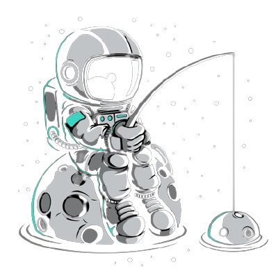

<div align="center">


<table>
<tr>
<td width="140" align="center">
  
</td>
<td align="left">
  <h1>Luis Ángel Díaz Díaz</h1>
  <a href="https://git.io/typing-svg">
    
  </a>
</td>
</tr>
</table>

<br/>


<br/><br/>


<br/><br/>

<a href="https://luisdiaz.dev">
  
</a>
<a href="https://www.linkedin.com/in/luis-angel-diaz-diaz">
  
</a>
<a href="mailto:luisangel@example.com">
  
</a>
<a href="https://github.com/luisdiaz04">
  
</a>

<br/><br/>


<a href="https://github.com/luisdiaz04?tab=followers">
  
</a>
<a href="https://github.com/luisdiaz04?tab=repositories">
  
</a>

</div>

---

## About

I am a software engineer focused on designing and delivering scalable, maintainable, and production-oriented applications. My work spans **full-stack development, backend architecture, DevOps practices, and database design**.

I approach engineering as a product discipline: understanding requirements, modeling reliable systems, making thoughtful technical trade-offs, and delivering solutions that provide measurable value. I enjoy working across the complete software lifecycle — from architecture and implementation to deployment, observability, security, and continuous improvement.

My technical interests include **containerized applications, Kubernetes, cloud infrastructure, machine learning integration, and developer experience**. I value clean architecture, strong typing, automation, testing, documentation, and pragmatic engineering decisions.

### Open To

- Software Engineering and Full-Stack Development opportunities
- Backend, Platform, Cloud, and DevOps engineering roles
- High-impact engineering teams building scalable products

---

## Tech Stack

### Languages

<p align="center">
  
</p>

### Frontend

<p align="center">
  
</p>

### Backend & Databases

<p align="center">
  
</p>

### Cloud, DevOps & Tooling

<p align="center">
  
</p>

---

## Terminal

<div align="center">
  
</div>

<div align="center">
  <br/>
  
  <br/>
  <sub>Compact, animated render of the astronaut ASCII art — see the full-resolution version below.</sub>
</div>

<details>
<summary><b>Full-resolution ASCII art</b></summary>

```
@@@@@@@@@@@@@@@@@@@@@@@@@@@@@@@@@@@@@@@@@@@@@@@@@@@@@@@@@@@@@@@@@@@@@@@@@@@@@@@@@@@@@@@@@@@@@@@@@@@@@@@@@@@@@@@@@@@@@@@@@@@@@@@@@@@@@@@
@@@@@@@@@@@@@@@@@@@@@@@@@@@@@@@@@@@@@@@@@@@@@@@@@@@@@@@@@@@@@@@@@@@@@@@@@@@@@@@@@@@@@@@@@@@@@@@@@@@@@@@@@@@@@@@@@@@@@@@@@@@@@@@@@@@@@@@
@@@@@@@@@@@@@@@@@@@@@@@@@@@@@@@@@@@@@@@@@@@@@@@@@@@@@@@@@@@@@@@@@@@@@@@@@@@@@@@@@@@@@@@@@@@@@@@@@@@@@@@@@@@@@@@@@@@@@@@@@@@@@@@@@@@@@@@
@@@@@@@@@@@@@@@@@@@@@@@@@@@@@@@@@@@@@@@@@@@@@@@@@@@@@@@@@@@@@@@@@@@@@@@@@@@@@@@@@@@@@@@@@@@@@@@@@@@@@@@@@@@@@@@@@@@@@@@@@@@@@@@@@@@@@@@
@@@@@@@@@@@@@@@@@@@@@@@@@@@@@@@@@@@@@@..@@@@@@@@@@@@@@@@@@@@@@@@@%@@@@@@@@@@@@@@@@@@@@@@@@@@@@@@@@@@@@@@@@@@@@@@@@@@@@@@@@@@@@@@@@@@@@@
@@@@@@@@@@@@@@@@@@@@@@@@@@@@@@@@@@@@@@@@@@@@@@@@@@@@@@@@@@@@@@@@+@@@@@@@@@@@@@@@@@@@@@@@@@@@@@@@@@@@@@@@@@@@@@@@@@@@@@@@@@@@@@@@@@@@@@
@@@@@@@@@@@@@@@@@@@@@@-@@@@@@@@@@@@@@@@@@@@@@*=:...:=@@@@@@@@@@@@@@@@@@@@+@@@@@@@@@@@:@@@@@@@@@@@@@@@@@@@@@@@@@@@@@@@@@@@@@@@@@@@@@@@@@
@@@@@@@@@@@@@@@@@@@@@@@@@@@@@@..#@@@@@@@@@#=:-----------:.:=:%@@@@@@@@@@@@@@@@@@@@@@@@@@@@@@@@@@@@@@@@@@@@@@@@@@@@@@@@@@@@@@@@@@@@@@@@@@
@@@@@@@@@@@@@@@@@@@@@@@*@@@@@@@@@*#@@@@=---=@@+-----------.:=:-@@@@@@@@@@@@@.@@@@@@@@@@@@@@@@@@@@@@@@@@@@@@@@@@@@@@@@@@@@@@@@@@@@@@@@@@
@@@@@@@@@@@@@@@@@@@@@@@@@@@@@@**@@@@----------@@-----------.#-::@@@@@@@@@@@@@@@@@@@.@@@@@@@@@@@@@@@@@@@@@@@@@@@@@@@@@@@@@@@@@@@@@@@@@@
@@@@@@@@@@@@@@@:@@@@@+@@@@@@@%+@@@@--------------@=----------.%--:-@@@@@@@@@@@@@@@@@@@@@@@@@@@@@@@@@@@@@@@@@@@@@@@@@@@@@@@@@@@@@@@@@@@@
@@@@@@@@@@@@@@@@@@@@@@@@@@@@@#*@@@@----------------@@:---------.*--:-@@@@@@@@@@@@@@@@@@@@@@@@@@@@@@@@@@@@@@@@@@@@@@@@@@@@@@@@@@@@@@@@@@@
@@@@@@@@@@@@@@@@@@@@@@@@@@@@@=@@@@-----------------#@@---------:=---.#@@@@@@@@@@@@@@@@@@@@@@@@@@-..@@@@@@@@@@@@@@@@@@@@@@@@@@@@@@@@@@@@@
@@@@@@@@@@@@@@@@@@@@@@@@@@@@=@@@@@-------------**%#++*##%%%%%%#*+*#@=.@@@@@@@@@@@@..@@@@@@@@@@@@@@@@@@@@#++:.:=:+%-%@@@@@@@@@@@@@@@@@@@@
@@@@@@@@@@@@@@@@@@@@-@@@@@@=@@@@*+=:------=#*%:.-:#@@@@@@@@@@@@@@%#@*@@@@@@@@@@@@@@@@@@@@@@@@@@@@*+-..-@@@@@@@@@@-@@@@@@@@@@@@@@@@@@@@@
@@@@@@@@@@@@@@@@@@@@@@@@@@@+@@+*---*=----%*--@@@@@@@@@@@@@@@@@@@...##%@@@@@@@@@@@@@@@@@@@@@@#*=.:*@@@@@@@@@@@@@@@-@@@@@@@@@@@@@@@@@@@@@
@@@@@@@@@@@@@@@@@@@@@@@@@@@+@@-***#=-*--++-:@@@@@@@@@@@@@@@@@@@@...#%%@@@::@@@@@@@@@@@@@*+::*@@@@@@@@@@@@@@@@@@@@-@@@@@@@@@@@@@@@@@@@@@
@@@@@@@@@@@@@@@@@@@@@@@@@@@=@*+*@@@@----#%.@@@@@@@@@@@@@@@@@@@@@:..@*@@@@-*@@@@@@@@@@*=.-@@@@@@@@@@@@@@@@@@@@@@@@-@@@@@@@@@@@@@@@@@@@@@
@@@@@@@@@@@@@@@@@@@@@@@@@@@*@%=%#@@@----+@.@@@@@@@@@:...+@@@@@@@:..@*@@@@@@@@@@@@@*+.=@@@@@@@@@@@@@@@@@@@-+@@@@@@-@@@@@@@@@@@@@@@@@@@@@
@@@@@@@@@@@@@@@@@@@@@@@@+@@@*@@-+#+--@--+@.....   ......#@@@@@@@..-@*@@@@@@@@@@*+.+@@@@@@@@@@@@@@@@@@@@@@@@@@@@@@-@@@@@@=@@@@@@@@@@@@@@
@@@@@@@@@@@@@@@@@@@@@@#%@@@@##@@@@@*----%#..          -@@@@@@@@*..@*@@@@@@@@@*+.@@@@@@@@@@@@@@@@@@@@@@@@@@@@@@@@@-@@@@@@@@@@@@@@@@@@@@@
@@@@@@@@@@@@@@..@@@@@=@@*#%@@*@@@@@%++--=*-.          .+@@@@@@@..@@%@@@@@@@++.*@@@@@@@@@=-@@@@@@@@@@@@@@@@@@@@@@@-@@@@@@@@@@@@@@@@@@@@@
@@@@@@@@@@@@@@@@@@@@*#*%@@*@@%=@@@@@#+++%*:..        ..@@@@@@..@%*@@@@@@+-.@@@@@@@@@@@@@@@@@@@@@@@@@@@@@@@@@@@@@-@@@@@@@@@@@@@@@@@@@@@
@@@@@@@@@@@@@@@@@@@@+++++%#@@@=+#+#@@@*++%*=....     .=@@@@@=@@*#@@@@@*+.@@@@@@@@@@@@@@@@@@@@@@@@@@@@@@@@@@@@@@@-@@@@@@@@@@@@@@@@@@@@@
@@@@@@@@@@@@@@@@@@@@=++++**@@@@@@*+*%**#@@@@#**#%@#+=+@@@@%**#-#@@@@*+::@@@@@@@@@@@@@@@@@@@@@.@@@@@@@@@@@@@@@@@@-@@@@@@#:%@@@@@@@@@@@@
@@@@@@@@@@@@@@@@@@@@=++++++@@#%@@#%@@@@#**++**#*+=------:-==%+=@@@*+-.@@@@@@@@@@@@..#@@@@@@@@@@@@@@@@@@..@@@@@@@-@@@@@@@@@@@@@@@@@@@@@
@@@@@@@@@@@@@@@@@@@@++++++*@@+*@@*+----=%#*@@@@++====--:--*@*-@.:*+.-@@@@@@@@@@@@@@@@@@@+-@@@@@@@@@@@@@@@@@@@@@@-@@@@@@@@@@@@@@@@@@@@@
@@@@@@@@@@@@@@@@@@@@=#++++##@*@@*+*%+=%-..+**@@@@%#****%%@#*#@=*++.@@@@@@@@@@@@@@@@@@@@@@@@@@@@@@@@@@@@@@@@@@@@@-@@@@@@@@@@@@@@@@@@@@@
@@@@@@@@@@@@@@@@@@@@*%++++@#@%@@+=======%:-@+*+:*--+++@===+**=*+-.@@@@@@@@@@@@@@@@@@@@@@@@@@@@@@@*@@@@@@@@@@@@@@-@@@@@@@@@@@@@@@@@@@@@
@@@@@@@@@@@@@@@@@@@@@@#%++@@*@*@======%+:--..@%::*#-:%-*:#@@@@*+:.@::@@@@@@@@@@@@@@@@@@@@@@@@@@@@@@@@@@@@@@@@@@@@-@@@@@@@:@@@@@@@@@@@@@
@@@@@@@@@@@@@@#.*@@@@@@@@+@@@@@+@+#@+==@+-----:.=@@@@%=@--@%++##*+..#-.*#@@@@@@@@@+@@@@+@@@@@@@@@@@@@@@@@@@@@@@@@@@@-@@@@@@@@@@@@@@@@@@
@@@@@@@@@@@@@@@@@@@@@@@+**@#=@@#*##@%+-----:.-.---:*#@#@@+------------.%@@@@@@@@@@@@@@@@@@@@@@@@@@@@@@@@@@@@@@@@@@-@@@@@@@@@@@@@@@@@@@@@
@@@@@@@@@@@@@@@@@@@@@@@=*:+@+@@=@#%*+=-----------:-@+@#@+=---------:.+#-@@@@@@@@@@@@@@@@@@@@@@@@@@@@@@@@@@@@@@@@@-@@@@@@@@@@@@@@@@@@@@@
@@@@@@@@@@@@@@@@@@@@@@#*%.*=#@@+@@###++#+-------@+@#%@=+%@#=----:.%=-.%=.@@@@@@@@@@@@@@@@@@@@@@@@@@@@@@@@@@@@@@@@-@@@@@@@@@@@@@@@@@@@@@
@@@@@@@@@@@@@@@@:@@@@@@@@@#@#+.===@*@@@+@%@*+=--=+#@@%*@#----#*++++---.#@+-%@@@@@@@@@@@@@@@@%@@@@@@@@@@@@@@@@@@@-@@@@@@@@@@@@@@@@@@@@@
@@@@@@@@@@@@@@@@@@@@@@@@@=@@@-...-=-=:*#%*##***@@@@@**@=---*#++---##:+@*#@+-:-@@@@@@@@@@@@@@@@@@@@@@@@@@@%@@@@@@@@-@@@*.*@@@@@@@@@@@@@@
@@@@@@@@@@@@@@@@@@@@@@@@@@##@@@@%*-:++@@@@@@+==**=##@@@*=-+@++---+%+*-..+@*-%-.@@@@@@@@@@@@@@@@@@@@@@@@@@@@@@@@@@-@@@@@@@@@@@@@@@@@@@@@
@@@@@@@@@@@@@@@@@@@@@@+@@@@@@@@@@%@@#*++++@@=-@*++#@@*++*%@@%@@@%*+:.....=@@@-*-+@@%=@@@@@@@@@@@@@@@@@@@@@@@@@@@@-@@@@@@@@@@@@@@@@@@@@@
@@@@@@@@@@@@@@@@@@@@@@@@@@@@@*@@@@*@@*+++*%-@++++*@+#@-----...@@*#=-----:.@#@@#+++@@@@@@@@@@#@@@@@@@@@@@@@@@@@@@@-@@@@@@@@@@@@@@@@@@@@@
@@@@@@@@@@@@@@@@@@-.@@@@@@@%#@@@@@@@+@*++*#-@+++++#@+%*------..-@@%*%*==-:@@@+=@@-=@@@@@@@@@@@@@@@@@@@@@@@@@@@@@@@-@@@@@@@@@@@@@@@@@@@@@
@@@@@@@@@@#*@@@@@@@@@@@@+@@@@++==*+@%+@@@==*+++++++##*@*---..+@@*+**#*=*%.%#---@--:*@@@@@@@@@@@@@@@@@@@@@@@@@@@@@-@@@@@@@@@@@@@@@@@@@@@
@@@@@@@@@@@@@@@@@@@@@@*%@@@@**++=----@%+@==*++#*#++++++*#**+%**@+=-------:.@-#*@@#-.@@@@@@@@@@@@@@@@@@@@@@@@@@@@@-@@@@@@@@@@@@@@@@@@@@@
@@@@@@@@@@@@@@@@@@@@%+@@@@@---------%@@@@%**@@@**+-------:..:.@@+---------.@*#++*@@.@@@@@@@@@@@@@@@@@@@@@@@@@@@@@-@@@@@@@@@@@@@@@@@@@@@
@@@@@@@@@@@@@@@@@@@@*%@@@@@--------*+++++@%+#@@@+*+-----------:@@*+-------#..=+-#@=-=@@@@@@@@@@@@@@@@@@@@@@@@@@@@@-@@@@@@@@@@@@@@@@@@@@@
@@@@@@@@@@@@@@@@@@@@*#@@@@@----------#+++*@*---@@*@*-----------:-@+++--------..@-------@@@@@@@@@@@@@@@@@@@@@@@@@@@@-@@@@@@@@@@@@@@@@@@@@
@@@@@@@@@@@@@@@@@@@**@@@@=-------------=+-------@@%%*----------..-@@++------..@@---+#+#@@@@@@@@@@@@@@@@@@@@@@@@@@@@-@@@@@@@@@@@@@@@@@@@@
@@@@@@@@@@@@@@.:@#=@@@@=-------------:-:-------@@*@++-------+@# -@@#@@@#*-..@@----#+++*@@@@@@@@@@@@@@@@@@@+:@@@@@@-@@@@@@@@@@@@@@@@@@@@@
@@@@@@@@@@@@@@@@@=@@++%+%----------:=*+---#-----@@%@%+------:..*@@-++@%@@=:+@#----**++*@@@@@@@@@@@@@@@@@@@@@@@@@@@-@@@@@@@@@@@@@@@@@@@@@
@@@@@@@@@@@@@@@@#=@==*+++#-------@#**#@@@@=-----=@#@@@++-:::--=@@@@@%++#+%=.:@+----#*+*@@@@@@@@@@@@@@@@@@@@@@@@@@@-@@@@@@@@@@@@@@@@@@@@@
@@@@@@@@@@@@@@@@++@:@++++%------@+++++++#@@@-----#@#@@%-##*%#=-.:@@@@@*+*+:::.-@#-------=@@@@@@@@@@@@@@@@@@@@@@@@@-@@@@@@@@@@@@@@@@@@@@@
@@@@@@@@@@@@@@@@=*@:@+++++-----#*++++++++@@@=----=@%@#+++*--=*%#+-@@@@@*==*:::..@@*------@@@@@@@@@@@@@@@@@@@@@@@@@-@@@@@@@@@@@@@@@@@@@@@
@@@@@@@@@@@@@@@@=+@==#++#-------@++++++++@@@------@*#++++#@----=+#+@@@@@*--+#%+-:-@@----:@@@@@@@@@@@@@@@@@@@@@@@@%-@@@@@@@@@@@@@@@@@@@@@
@@@@@@@@@@@@@@@@+=@@@--=@%--==-=-%#++++%@@=-------@#@+++++@##:---=+++@@@@@#+-----:..#%---@@@@@@@@@@@@@@@@@@*=%@=-:-:..%-:*@@@@@@@@@@@@@@
@@@@@@@@@@@@@@@@+=@*--#@@=-------%#-:--:-=---------@@%++++%*+%%+----:..@@@+--------..=--+@@@@@@@@@@@@@@@%=@@@%-------::---.=@@@@@@@@@@@@
@@@@@@@@@@@@@@@@=@-*+++%------------------+-------@%%%+++@%++-------..+@@*=-------..=@-*@@@@@@@@@@@@@@#%@@@@--------------..*@@@@@@@@@@
@@@@@@@@@@@@*@@*@@+=+@++-@*--------------@--*@@@@@*--@*@@+@+++--------..#@@@#+-----..*.@#@@#@@@@@@@@@@@*+@@@@@=----------%%+-..*@@@@@@@@
@@@@@@@@@+@@%*@@@+=#-=*@@@+-----------=-**++++#@@@:+@=+@@+++-------:.+#@@#@@@@%#*+=-=@@@@%*@@@@@@@@@@=@@@@%%@@+--------*+*=-..@@@@@@@@@
@@@@@@@@@**@@@**@@@@*=@@@@@----------#-#*++++++#@@:-=@*%%%@*++---:.#=.@@@@@*+*++++*@@@@@**@@@@@@@@*@%=@@@@%#@==--------*++#-..#@@@@@@@@
@@@@@@@@@@#+#@@@@#**%@@@@@@@#=--------=*+++++*@@=----=@@++++------.:@@@@@@@@@@@@@@#**@@@@@@@@@@@#*@@@+=@@@@@@=--------=-::.*@*@@@@@@@@
@@@@@@@@@@@@@@***@@@@@@@@%#%@@@@@@@@@@*+@%*@@*---:----@@@@#*+----*@@@@@@@@%##*%@@@@@%@@@@@@@@@@@#@#*#@@@@*+**%@@=-----=*%**%@@@%#@@@@@
@@@@@@@@@@@@@@@@@@@@@#+*#*#@@@@@@@@@@@@@@@@@@@@@@@@@@@@@@@@@@@@@@@@@@@@@@@@@@%%%#%@@@@@@@@@@@@@@@@@@###%@%*#%###%%%%%%%%%@%%@%#*@@@@@@@@
@@@@@@@@@@@@@@@@@@@@@@@@@@@@@@@%*++**#***#%%@@@@@@@@@@@@@%##*###***%@@@@@@@@@@@@@@@@@@@@@@#@@@@@@@@@@@@@@@%#***###***#%@@@@@@@@@@@@@@@
@@@@@@@@@@@@@@@@@@@@@@@@@@@@@@@@@@@@@@@@@@@@@@@@@@@@@@@@@@@@@@@@@@@@@@@@+@@@@@@@@@@@@@@@@@@@@@@@@@@@@@@@@@@@@@@@@@@@@@@@@@@@@@@@@@@@@@
@@@@@@@@@@@@@@@@@@@@@@@@@@@@@@@@@@@@@@@@@@@@@@@@@@@@@@@@@@@@@@@@@@..+@@@@@@@@@@@@@@@@@@..-@@@@@@@@@@@@@@@@@@@@@@@@@@@@@@@@@@@@@@@@@@@@@
@@@@@@@@@@@@@@@@@@@@@@@@@@@@@@@@@@@@@@@@@@@@@@@@@@@@@@@@@@@@*@@@@@@@@@@@@@@@@@@@@@@@@@@@@@@@@@@@@@@@@@@@@@@@@@@@@@@@@@@@@@@@@@@@@@@@@@@
@@@@@@@@@@@@@@@@@@@@@@@@@@@@@@@@@@@@@@@@@@@@@@@@@@@@@@@@@@@@@@@@@@@@@@@@@@@@@@@@@@@@@@@@@@@@@@@@@@@@@@@@@@@@@@@@@@@@@@@@@@@@@@@@@@@@@@
@@@@@@@@@@@@@@@@@@@@@@@@@@@@@@@@@@@@@@@@@@@@@@@@@@@@@@@@@@@@@@@@@@@@@@@@@@@@@@@@@@@@@@@@@@@@@@@@@@@@@@@@@@@@@@@@@@@@@@@@@@@@@@@@@@@@@@
@@@@@@@@@@@@@@@@@@@@@@@@@@@@@@@@@@@@@@@@@@@@@@@@@@@@@@@@@@@@@@@@@@@@@@@@@@@@@@@@@@@@@@@@@@@@@@@@@@@@@@@@@@@@@@@@@@@@@@@@@@@@@@@@@@@@@@
```

> Raw source: [`ascii-full.txt`](./assets/ascii-full.txt)

</details>

---

## Featured Projects

<details>
<summary><b>Bonetería Sofy — Inventory & Sales Management Platform</b></summary>

<br/>

A full-stack inventory and sales system built to improve product control, stock visibility, transaction management, and operational reporting for a retail business.

| Category | Details |
|:---|:---|
| **Stack** | React-Native, Vite, Tailwind CSS, Node.js, Express, MongoDB |
| **Scale** | Designed for daily inventory operations and business reporting |
| **Performance** | Efficient API queries and client-side state management |
| **Security** | JWT authentication, protected routes, password hashing, and role-aware access |
| **Impact** | Improves inventory accuracy and reduces manual administrative work |
| **Repository** | [View Repository](https://github.com/luisdiaz04) |

**Engineering Focus:** REST API design, inventory lifecycle management, authentication, analytics dashboards, and responsive user experience.

</details>

<details>
<summary><b>Kasadi — Real Estate Discovery Platform</b></summary>

<br/>

A modern real-estate web platform focused on property discovery, structured listings, responsive performance, and a maintainable content architecture.

| Category | Details |
|:---|:---|
| **Stack** | Astro, JavaScript, HTML, CSS, Tailwind CSS |
| **Scale** | Structured to manage dozens of property listings |
| **Performance** | Static-first rendering and optimized frontend delivery |
| **Security** | Minimal attack surface through static architecture and controlled integrations |
| **Impact** | Improves property visibility and provides a streamlined discovery experience |
| **Repository** | [View Repository](https://github.com/luisdiaz04) |

**Engineering Focus:** Performance-first frontend architecture, SEO, reusable components, responsive design, and content organization.

</details>

<details>
<summary><b>Sudoku — Containerized Web Application</b></summary>

<br/>

A containerized web application used to explore reproducible deployments, Kubernetes workloads, service exposure, and cloud-native application delivery.

| Category | Details |
|:---|:---|
| **Stack** | JavaScript, Docker, Kubernetes, NGINX |
| **Scale** | Deployable as a replicated container workload |
| **Performance** | Lightweight container image and efficient static delivery |
| **Security** | Isolated workloads and controlled service exposure |
| **Impact** | Demonstrates practical container orchestration and deployment automation |
| **Repository** | [View Repository](https://github.com/luisdiaz04) |

**Engineering Focus:** Docker image design, Kubernetes deployments, services, ingress configuration, and environment reproducibility.

</details>

---

## Experience

### Software Engineering Projects & Independent Development

**Full-Stack Software Engineer**
**Independent Projects & Academic Engineering**
**2023 — Present**

Designing and delivering full-stack applications with a focus on scalable architecture, secure backend systems, modern user interfaces, cloud-native deployment, and practical business impact.

**Scope of work**

- Architect and implement RESTful APIs using Node.js, Express, TypeScript, and modern backend patterns.
- Build responsive, accessible, and maintainable interfaces using React, Vue, Astro, Vite, and Tailwind CSS.
- Design relational and document-oriented data models using PostgreSQL, MySQL, MongoDB, Prisma, and Mongoose.
- Containerize applications with Docker and deploy workloads using Kubernetes, services, ingress, and CI/CD workflows.
- Apply engineering practices including version control, modular architecture, validation, documentation, and automated workflows.

**Skills**

`TypeScript` `JavaScript` `React` `Node.js` `PostgreSQL` `MongoDB` `Docker` `Kubernetes` `GitHub Actions` `REST APIs` `System Design`

---

## Achievements

<div align="center">

| Recognition | Details |
|:---|:---|
| **Interledger Student Hackathon — Oaxaca** | Participated in collaborative software development and innovation activities focused on real-world technology solutions |
| **Full-Stack Engineering Portfolio** | Built and deployed projects spanning inventory systems, SaaS architecture, streaming platforms, real-estate applications, and cloud-native workloads |
| **Cloud-Native Engineering Practice** | Developed hands-on experience with Docker, Kubernetes, container networking, services, ingress, and reproducible deployments |
| **Open-Source Collaboration** | Contributed to collaborative repositories through Git workflows, pull requests, code review, and technical documentation |
| **Continuous Technical Growth** | Expanded expertise across backend systems, databases, DevOps, cloud infrastructure, AI integration, and modern frontend engineering |

</div>

---

## Certifications

<p align="center">
  
</p>

---

## Coding Profiles

<div align="center">

<a href="https://leetcode.com/">
  
</a>

</div>

---

## GitHub Analytics

<div align="center">


<br/>


</div>

---

## GitHub Trophies

<div align="center">


</div>

---

## Current Focus

```yaml
Learning:
  - Advanced system design
  - Kubernetes and platform engineering
  - Distributed systems

Building:
  - Scalable full-stack applications
  - Secure backend services
  - Cloud-ready deployment workflows

Exploring:
  - MLOps foundations
  - Developer tooling and automation

Open_To:
  - Software engineering opportunities
  - Full-stack and backend roles
  - Cloud and DevOps engineering
  - Open-source collaboration
  - High-impact product teams
```

<div align="center">
  
</div>
