<h3><code>luis@github ~ $ whoami</code></h3>
<table>
  <tr>
    <td valign="top"></td>
    <td valign="top"></td>
  </tr>
</table>

## GitHub Analytics

 

  <picture>
    <source
      media="(prefers-color-scheme: dark)"
      srcset="https://raw.githubusercontent.com/luis50019/luis50019/pacman-output/pacman-contribution-graph-dark.svg"
    />
    <source
      media="(prefers-color-scheme: light)"
      srcset="https://raw.githubusercontent.com/luis50019/luis50019/pacman-output/pacman-contribution-graph.svg"
    />
    
  </picture>

  

## Tech Stack

### Languages

  

### Frontend

  

### Backend & Databases

  

### Cloud, DevOps & Tooling

  

## Achievements

| Recognition | Details |
|:---|:---|
| **Interledger Student Hackathon — Oaxaca** | Participated in collaborative software development and innovation activities focused on real-world technology solutions |
| **Full-Stack Engineering Portfolio** | Built and deployed projects spanning inventory systems, SaaS architecture, streaming platforms, real-estate applications, and cloud-native workloads |
| **Cloud-Native Engineering Practice** | Developed hands-on experience with Docker, Kubernetes, container networking, services, ingress, and reproducible deployments |
| **Open-Source Collaboration** | Contributed to collaborative repositories through Git workflows, pull requests, code review, and technical documentation |
| **Continuous Technical Growth** | Expanded expertise across backend systems, databases, DevOps, cloud infrastructure, AI integration, and modern frontend engineering |

